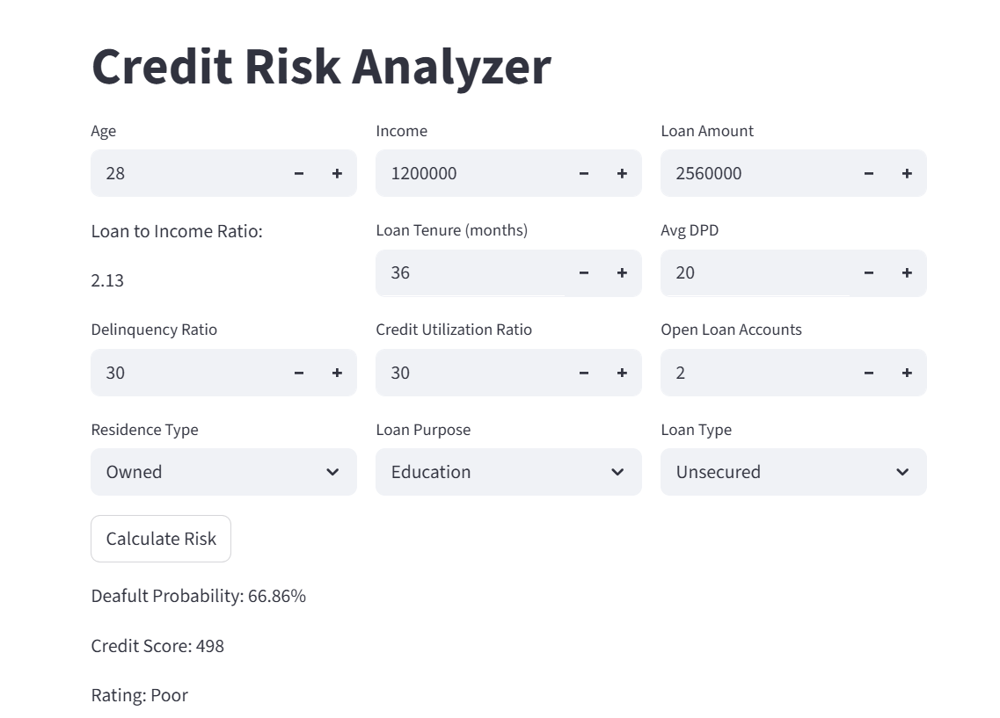

# 📊 Credit Risk Analyzer

A Machine Learning based Streamlit application that predicts loan default probability, generates a credit score, and assigns a risk rating.

## 🚀 Features

- Predict loan default probability
- Generate credit score (300–900)
- Assign risk rating
- Interactive Streamlit dashboard

## 🛠️ Tech Stack

- Python
- Pandas
- NumPy
- Scikit-Learn
- Streamlit
- Joblib

## 📂 Project Structure

```text
Credit-Risk-Analyzer/
│
├── artifacts/
│   └── model_data.joblib
├── screenshots/
├── main.py
├── prediction_helper.py
├── requirements.txt
└── README.md
```

## 📋 Inputs

- Age
- Income
- Loan Amount
- Loan Tenure
- Avg DPD
- Delinquency Ratio
- Credit Utilization Ratio
- Open Loan Accounts
- Residence Type
- Loan Purpose
- Loan Type

## 📈 Outputs

- Default Probability
- Credit Score
- Risk Rating

## 📸 Screenshot



## ▶️ Run Locally

```bash
pip install -r requirements.txt
streamlit run main.py
```

## 👨‍💻 Author

**Paras**

Transforming data into insights and models into real-world solutions.